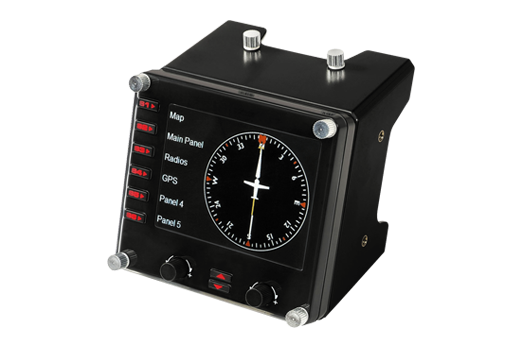
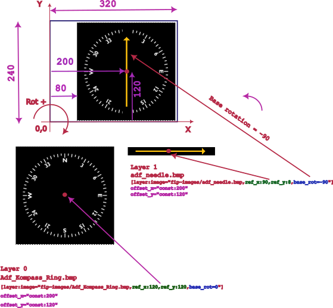

# Saitek Flight Information Panel (FIP)
## General description
The Saitek FIP is a mini screen with 320x240 pixel resolution and a USB connection. The main purpose of the
the device is to display flight instruments (speed, altimeter, vario, HSI, CDI, etc.)
The FIP device contains six push buttons with LED backlight, two rotation knobs, and an up/down 
button to change the virtual pages. 
[See details here.](https://support.logi.com/hc/hu/articles/360025266434-Product-Gallery-Flight-Instrument-Panel)



The Xpanel plugin allows you to customize the screen content and connect it to the 
simulator's internal values. Of course, the button functions and the LED backlights are also
configurable with the plugin.

## Saitek FIP device
The FIP device connects to the PC via a USB bulk endpoint. It has support for virtual pages
which means you can define many pages with different contents and the pages can be changed
runtime by the up/down arrow buttons on the device. 

The device can be identified and opened by the unique serial number of your device. This serial number is displayed on the screen as soon as
you give power to the device. For example my test device serial number MZB05779E2.
The unique serial number allows you to connect more than one FIP device at the same time. 

It can display 24-bit BMP data (without the header and padding parts) 

The current implementation uses the Saitek device driver which provides the low-level
functions to set images on the screen and handle buttons/LEDs.
## How to install FIP device driver?
### Windows
First of all, you need to install the Saitek/Logitech FIP device driver. 
This can be downloaded from [this location](https://download01.logi.com/web/ftp/pub/techsupport/simulation/Flight_Instrument_Panel_x64_Drivers_8.0.150.0.exe)
Please note: you need only the "Flight Instrument Panel Drivers" from the above location. The Logitech support page
contains an "X Plane Plug-in". If you installed it previously please remove it because this will 
conflict with the XPanel plugin.
### Linux/Mac
Currently, Saitek/Logitech doesn't provide the device driver for Linux and Mac systems.
Therefore it can't be used on that operating system. I'm looking for the replacement of 
the device driver on these systems.

## Config options
The Xpanel config options are created to reflect the SW design hierarchy. 
At the top level, the FIP *device* is declared with its serial number.

The device contain one *screen*, 6 push *buttons*, 2 *rotation knobs* and 6 *LEDs*.
For the button and LED light handling you can use the same actions and triggers as for the other USB devices (Radio, Multi, etc)

The config item "screen" can contain many virtual *pages*. Each virtual page can be a different flight
instrument like a Speed meter, CDI, HSI, etc. You can select the actual page by the up/down arrow buttons.

A virtual page is composed of multiple *layers*. Layers are BMP files with 24-bit color depth.

Layers are put in the order of appearance in the config file. The first layer will be the 
backmost while the last will be in the front. The black color pixels (RGB: 0,0,0) are used as
transparent pixels, so those pixels won't overwrite layers behind them.

```ini
[device:id="saitek_fip_screen"]
serial="YOUR_DEVICE_SERIAL"

    [screen:id="fip-screen"]
    [page:id="ADF"]
        [layer:image="fip-images/Adf_Kompass_Ring.bmp,ref_x:120,ref_y:120,base_rot=0"]
        offset_x="const:200"
        offset_y="const:120"
        rotation="dataref:sim/cockpit/radios/adf1_cardinal_dir,scale:-1"

        [layer:image="fip-images/adf_needle.bmp,ref_x:90,ref_y:8,base_rot=-90"]
        offset_x="const:200"
        offset_y="const:120"
        rotation="dataref:sim/cockpit2/radios/indicators/adf1_relative_bearing_deg,scale:1"
```
Each layer has a reference point (ref_x, ref_y). This is the point of the layer we use during the transformations of the layer.
You can select the most convenient reference point which allows you to use to either translate or rotate a layer.

For your convenience, the layer can have a base rotation value. This means that even if the BMP file is created with a different
orientation you can rotate it according to your purposes. Further rotation is allowed on the layer but the
rotation angle=0 will be the position defined by the base_rot property.

A layer can be moved in two different ways: translation and rotation.


### Translate a layer
You can move the layer in horizontal or vertical directions or both. A horizontal translation
is declared in the config file by the offset_x and the vertical one by offset_y.

The value for the translation is in pixel units. You can use three different sources for translation value:
* constant value
* dataref value
* return value of a lua function

The ref_x, ref_y point of your BMP file will be moved to the value of position defined by offest_x and offest_y respectively.

If you define more than one offest_x only the last one will be used. The same is true for the offset_y as well.
### Rotate a layer
The center of rotation is the ref_x and ref_y property defined in the layer declaration.
The angle of rotation is defined in degree units (not radians). The positive rotation angle means clockwise rotation.
Similar to translations you can use three different sources for the rotation angle:
* constant value
* dataref value
* return value of a lua function

### Mask a layer
You can define mask for a layer. This means that only a part of the layer image will be drawn. It is usefull to draw a sliding scale (like a linear altimeter scale on a PFD). The mask is positioned to the screen coordinates
so in the configuration file you should define this:
```ini
        [page:id="TEST_MASK"]
            [layer:image="fip-images/bmp_test_big_image.bmp,ref_x:0,ref_y:157,base_rot=0"]
            mask="screen_x:0,screen_y:120,height:100,width:60"
```
With the above config only those parts of the layer image will be displayed that are inside the defined mask window.

## Create your own custom instrument displays
In this example, we create a virtual ADF display. The ADF has a needle pointer and
a background scale which can be rotated by the OBS knob. You can see this kind of instrument on many GA aircraft like C172-SP.

### Create the necessary BMP files
This ADF instrument will have two layers. One for the ring scale and one for the needle.
These layers shall be drawn as 24-bit color depth BMP files. The background color of the images
shall be RGB 0,0,0 (black).

### Install the BMP files
Put the BMP files into the aircraft folder parcticaly into a separated sub-folder.
I use the folder name fip-images but for sure you can use any other name. The config
file refer to the above folder relative to the current aircraft folder.
In my config a BMP file is refered like this:
```ini
[layer:image="fip-images/Adf_Kompass_Ring.bmp..."]
```
#### Ring scale
The ring scale image can be found in test/fip-images/Adf_Kompass_Ring.bmp:


The size of the BMP file is 240x240 pixel.

As this ring scale can be rotated by the OBS knob,
we select as a refence point the middle of the image (120,120). This will be the rotation 
center.
We want to put the image in the top-right
corner of the 320x240 size screen. This means we have to translate the image along the x-axis
by 200 pixels (320-120=200). 

The angle of rotation is connected to a dataref value of the simulator. If you turn the rotation OBS 
in the simulator, the dataref value will be updated. The plugin will read this value and rotate the image
according to the actual value. The scale parameter means a proportional
scale factor for the amount of rotation. The -1.0 in this example simply means an inverted direction.
If you put for example -1.5 it will rotate x1.5 speed.

```ini
[page:id="ADF"]
    [layer:image="fip-images/Adf_Kompass_Ring.bmp,ref_x:120,ref_y:120,base_rot=0"]
    offset_x="const:200"
    offset_y="const:120"
    rotation="dataref:sim/cockpit/radios/adf1_cardinal_dir,scale:-1"
```

#### Needle
Similar to the previous image we have to create the BMP file for the needle: test/fip-images/Adf_Kompass_Ring.bmp:


The reference point for this image set to the center (90,8). This is the middle of the image.
It is practical to select this point because we have to rotate the needle according to dtaref
value in the simulator.

We apply a x=200, y=120 translation to put the center of the image to the same position as
we put the ring scale image previously.
The rotation of needle (on this default C172 aircraft) shall be connect to the adf1_relative_bearing_deg dataref

```ini
    [layer:image="fip-images/adf_needle.bmp,ref_x:90,ref_y:8,base_rot=-90"]
    offset_x="const:200"
    offset_y="const:120"
    rotation="dataref:sim/cockpit2/radios/indicators/adf1_relative_bearing_deg,scale:1"
```